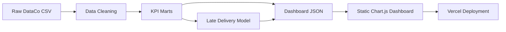

# Supply Chain Risk Intelligence

[](https://supply-chain-risk-intelligence-two.vercel.app)
[](requirements.txt)
[](docs/methodology.md)

An end-to-end data analytics and data science portfolio project that turns **180,519 DataCo supply chain orders** into a delivery-risk monitoring dashboard, profitability analysis, and leakage-aware late delivery prediction model.

**Live dashboard:** https://supply-chain-risk-intelligence-two.vercel.app  
**Dataset:** DataCo Smart Supply Chain for Big Data Analysis  
**Project type:** Data Engineering, Data Analysis, Data Science, Business Intelligence

## Executive summary

Supply chain teams need to know which orders, shipping modes, regions, and customer segments create service-level risk before delays become customer problems. This project builds a reproducible Python workflow that cleans raw order data, creates KPI marts, trains a late-delivery risk model, and publishes an executive dashboard for delivery risk, profit quality, and operational recommendations.

## Key results

- **180,519 orders** analyzed from a public supply chain dataset.
- **54.83% late-delivery risk rate** in historical orders.
- **$36.78M sales proxy** and **$3.97M profit or benefit proxy** profiled across market, region, category, and customer segment.
- **Random Forest selected** using a business-weighted score focused on late-class recall, F1, and ROC-AUC.
- **57.73% recall for late-risk class** with post-shipment leakage fields excluded.
- Static dashboard deployed on Vercel with prebuilt JSON assets, so the portfolio demo loads without a backend server.

## What the project answers

1. Which shipments are most likely to be late?
2. Which shipping modes, markets, and regions create the highest delivery risk?
3. Which product categories and customer segments drive sales and profit?
4. Where do high-revenue segments show weak margins or high delay risk?
5. Can late-delivery risk be scored before fulfillment is completed?
6. What operational actions should be prioritized to improve service level and profit quality?

## Dashboard sections

- **Overview:** orders, sales, profit, late risk, model recall, delivery status distribution, and monthly trend.
- **Delivery Risk:** late rate by shipping mode and risky region x shipping mode combinations.
- **Profitability:** category performance, high-revenue low-margin segments, margin, and late-risk comparison.
- **Customer Region:** customer segment x market performance.
- **Model Insights:** feature importance, risk score distribution, and high-risk scored orders.
- **Recommendations:** operational actions for SLA review, routing, risk queue setup, and margin protection.
- **Jurnal Riset:** Indonesian research journal embedded in the dashboard for recruiter-friendly explanation.

## Repository structure

```text
supply-chain-risk-intelligence/
├── dashboard/
│   ├── index.html                         # Static Chart.js dashboard
│   └── assets/dashboard_data.json          # Prebuilt dashboard data asset
├── data/
│   └── marts/                              # Tracked KPI and model-output marts
├── docs/
│   ├── data_dictionary.md
│   ├── methodology.md
│   ├── limitations.md
│   └── research_journal_id.md
├── notebooks/
│   └── 01_eda_supply_chain.ipynb
├── scripts/
│   ├── prepare_data.py                     # Raw data cleaning and KPI mart generation
│   ├── train_model.py                      # Leakage-aware model training
│   └── build_dashboard_data.py             # Dashboard JSON builder
├── index.html                              # Redirect to dashboard
├── vercel.json                             # Static deployment routing
└── requirements.txt
```

## Pipeline



### 1. Prepare data and KPI marts

```bash
python scripts/prepare_data.py
```

Outputs:

- `data/processed/orders_clean.csv`
- `data/marts/delivery_kpis.csv`
- `data/marts/profitability_kpis.csv`
- `data/marts/region_shipping_kpis.csv`
- `data/marts/category_performance.csv`
- `data/marts/customer_market_kpis.csv`
- `data/marts/monthly_delivery_trend.csv`
- `data/marts/data_profile.json`

### 2. Train the late-delivery risk model

```bash
python scripts/train_model.py
```

Outputs:

- `models/late_delivery_risk_model.joblib`
- `data/marts/model_metrics.json`
- `data/marts/feature_importance.csv`
- `data/marts/model_scoring_sample.csv`

The model is designed as an operational risk-scoring prototype. It excludes post-shipment leakage fields that would not be known at the time of pre-fulfillment scoring:

- `Delivery Status`
- `Days for shipping (real)`
- `shipping_gap`
- `shipping date (DateOrders)`
- `Order Status`

### 3. Build dashboard data

```bash
python scripts/build_dashboard_data.py
```

Output:

- `dashboard/assets/dashboard_data.json`

### 4. Run locally

```bash
python -m http.server 8000 -d dashboard
```

Open:

```text
http://localhost:8000
```

## Model result

Two baseline models are trained and compared with business priority on late-class recall.

**Best model selected:** Random Forest

- Accuracy: **69.57%**
- Precision for late-risk class: **81.35%**
- Recall for late-risk class: **57.73%**
- F1 for late-risk class: **67.54%**
- ROC-AUC: **75.63%**

Random Forest is selected because it has the best business-weighted composite score, not because it has the highest raw accuracy. The scoring logic gives the largest weight to late-class recall because missed risky shipments are more expensive than sending some safe orders into a monitoring queue.

## Business interpretation

The model is useful as a portfolio-grade risk-scoring baseline, but it is not positioned as a production SLA engine. The result is intentionally conservative because the model avoids leakage from post-shipment fields. A realistic next iteration would tune thresholds, evaluate PR-AUC, calibrate probabilities, test cost-sensitive learning, and add operational features such as carrier capacity, warehouse backlog, route distance, weather, and live inventory.

## Skills demonstrated

### Data Engineering

- Raw CSV ingestion and cleaning
- Column standardization and date parsing
- PII-like field exclusion from public processed outputs
- KPI mart generation for dashboard consumption
- Static JSON asset build for deployment

### Data Analysis

- Delivery risk analysis by shipping mode, market, and region
- Category and customer-segment profitability analysis
- High-revenue low-margin segment detection
- Monthly delivery trend analysis

### Data Science

- Leakage-aware feature selection
- Baseline model comparison
- Feature importance analysis
- Risk probability scoring and bucketization
- Model interpretation tied to operational use cases

### Business Intelligence

- Executive KPI dashboard
- Interactive Chart.js visualizations
- Risk and profitability storytelling
- Action-oriented recommendations
- Indonesian research journal for accessible explanation

## Data source and reproducibility note

Dataset: **DataCo Smart Supply Chain for Big Data Analysis**

Raw files are intentionally not tracked in this repository because they are large local source files. The repository keeps the dashboard-ready marts and JSON asset so reviewers can inspect the final outputs and run the static dashboard without rebuilding the full pipeline.

Expected local raw files:

- `data/raw/DataCoSupplyChainDataset.csv`
- `data/raw/DescriptionDataCoSupplyChain.csv`
- `data/raw/tokenized_access_logs.csv`

## Documentation

- [Methodology](docs/methodology.md)
- [Data dictionary](docs/data_dictionary.md)
- [Limitations](docs/limitations.md)
- [Research journal in Indonesian](docs/research_journal_id.md)
- [CV and portfolio summary](docs/cv_portfolio_summary.md)
- [Release notes](RELEASE_NOTES.md)

## Limitations

- The dataset is public and historical, not connected to a live supply chain system.
- Some fields can create target leakage if used incorrectly. The operational model excludes post-shipment fields.
- The model is a portfolio-grade decision-support prototype, not a production SLA engine.
- No real carrier capacity, warehouse capacity, weather, route distance, or live inventory data is included.
- Financial fields are analyzed as provided by the dataset and may not represent audited company-level financials.

## Author

**Fityan Hanif**  
Data Analyst / Data Scientist portfolio project  
GitHub: [@fityanhanif](https://github.com/fityanhanif)
